# Keeping the site fresh

Everything on brbeerhub.com is yours to change — the words, the hours, the
events, the photos — from one editing screen at `/studio`. This page walks
through all of it with pictures. Nothing here touches code, and nothing you do
here can break the site.

## Start here

Three things to know before anything else:

1. **The editor lives at `/studio`.** Bookmark brbeerhub.com/studio and sign
   in with the Google account you were invited with.
2. **Nothing is live until you press Publish.** Every change starts as a draft
   only you can see. Visitors keep seeing the old version until you publish.
3. **Publishing takes a minute or two** to reach the live site. If it hasn't
   after a few minutes, reload the page while holding <kbd>Shift</kbd>.

### What do you want to do?

- [Change the words on the page](#change-the-words-on-the-page)
- [Post the month's events](#post-the-months-events)
- [Put up or take down the banner](#the-announcement-banner)
- [Change hours, phone, or links](#hours-phone-and-links)
- [Add or remove photos](#photos)
- [Something looks wrong](#when-something-looks-wrong)

## A tour of the editor

When you open `/studio` you land on a picture of the website with the editing
form beside it. Here's what's what.

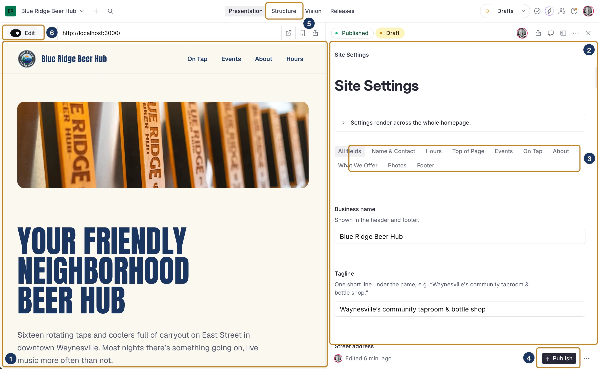

1. **The website.** This is the real page, not a copy. Click any writing on
   it to change it.
2. **The form.** The same content as fields. Whatever you click on the left
   opens here.
3. **Tabs.** Site Settings is split into tabs — Name & Contact, Hours, Top of
   Page, and so on — so you're never scrolling through everything at once.
4. **Publish.** Nothing goes live until you press this. It stays grey until
   you've changed something.
5. **Structure.** The list view. Events, Weekly Events, and Gallery Photos
   live here.
6. **The Edit switch.** When it's on, clicking words on the page lets you type
   them. Switch it off to click around the site normally.

## Drafts and publishing

Every edit you make is a **draft** until you press **Publish**. Drafts are
private: visitors keep seeing the last published version.

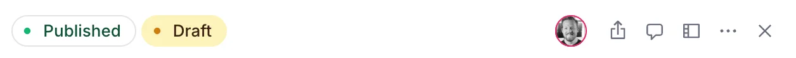

- **Publish** is at the bottom right of the form. It goes grey again once
  everything is live.
- **Changed your mind?** Click the three dots next to Publish and choose
  **Discard changes**. The draft is thrown away and the published version
  stays exactly as it was.

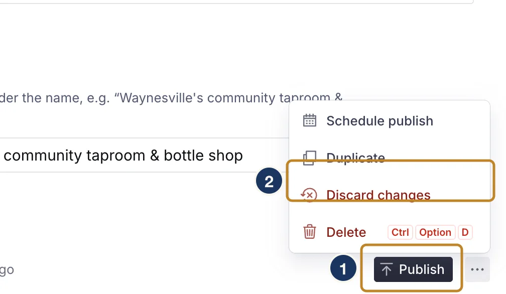

> **Heads up:** **Delete**, in that same menu, removes the whole thing — the
> event, the photo — not just your changes. It asks you to confirm first.

## Change the words on the page

The quickest way to fix a typo or reword something: click it and type.

1. Open `/studio`. Check that the **Edit** switch at the top left is on.
2. Click any writing on the page — a heading, a paragraph, a button label,
   the hours, the small print at the bottom. A cursor appears and you can type.
3. Press <kbd>Enter</kbd> or click somewhere else when you're done. Press
   <kbd>Esc</kbd> to throw away what you just typed and put the old words back.
4. Press **Publish**.

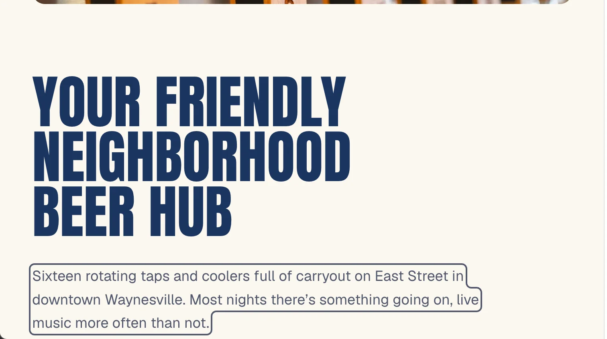

A few things aren't words and can't be typed over: photos, event dates and
times, the little colored category tags, and links. Click those and the form
on the right jumps to the matching field — change it there. The "16" on the
tap card works this way too, since it's a number.

> **Tip:** Every bit of writing also has a field in the form, so if you'd
> rather work from a form, use the tabs in Site Settings or the lists under
> Structure. Both roads lead to the same place.

## Post the month's events

### The robot does most of it

When you post the monthly flyer to Facebook, the website reads it overnight.
The next morning you get an email listing what it found.

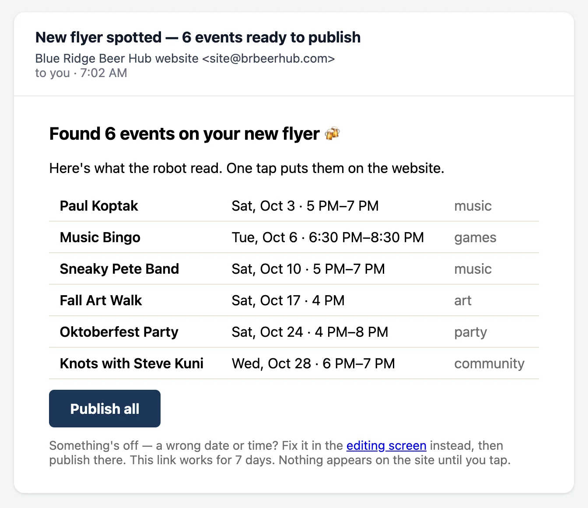

- **Everything looks right?** Tap **Publish all**. That's the whole job.
- **Something's wrong** — a bad date, a wrong time? Don't tap publish. Open
  `/studio` → **Structure** → **Events**, fix the drafts there, and publish
  them one at a time.
- **Fixed a date on the flyer itself?** The robot won't re-read corrections.
  Make the same fix in the editor.
- **No email the morning after you posted?** Add the events by hand (next
  section). The robot is a convenience, not a requirement.

> **Note:** Who receives the email is a list under Site Settings → Name &
> Contact → *Who gets the "new events found" email*. If nobody is on it, the
> robot has no one to write to. [See where that is.](#the-announcement-banner)

### Adding events by hand (about 15 minutes)

1. Open `/studio` and click **Structure** in the top bar.
2. Click **Events**, then the **+** at the top of the list.

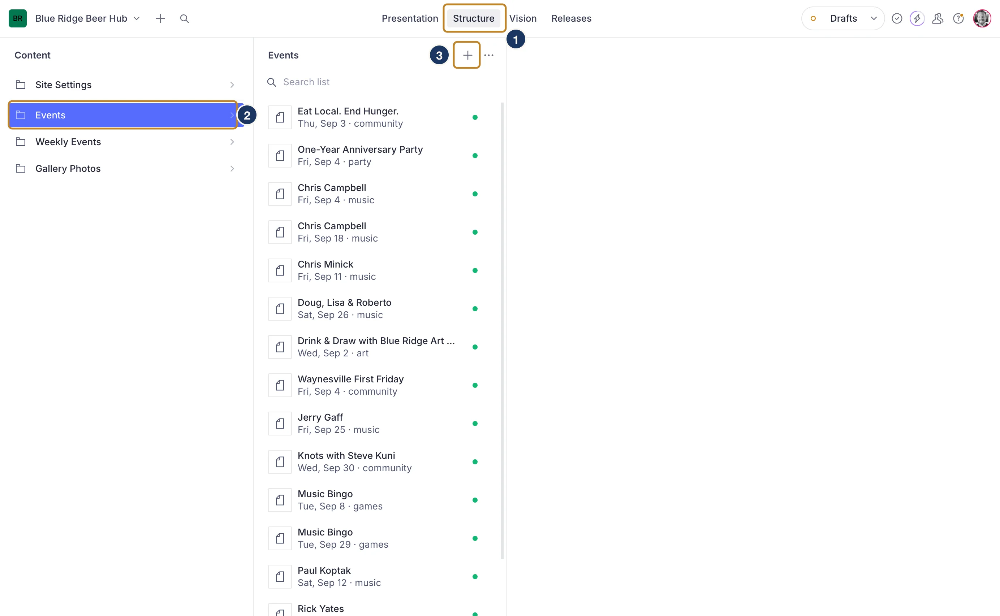

3. Fill in the form: **Event name**, **Date & start time**, **End time** if it
   has one, and a **Type** — that's what sets the colored tag on the site.

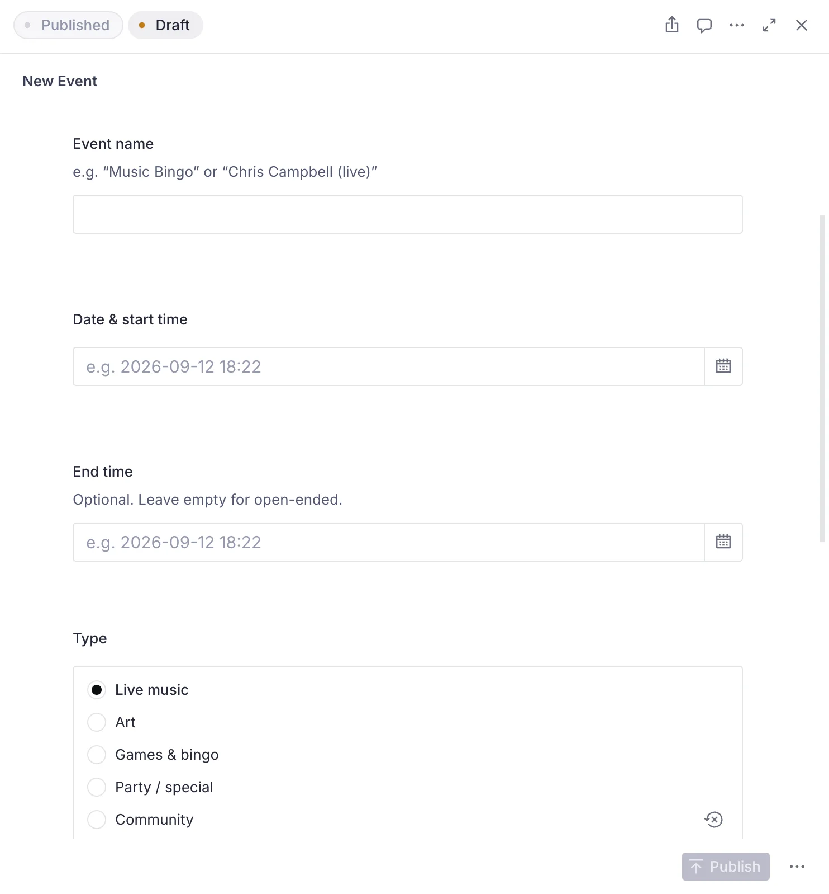

4. Press **Publish**. Repeat for each thing on the flyer.

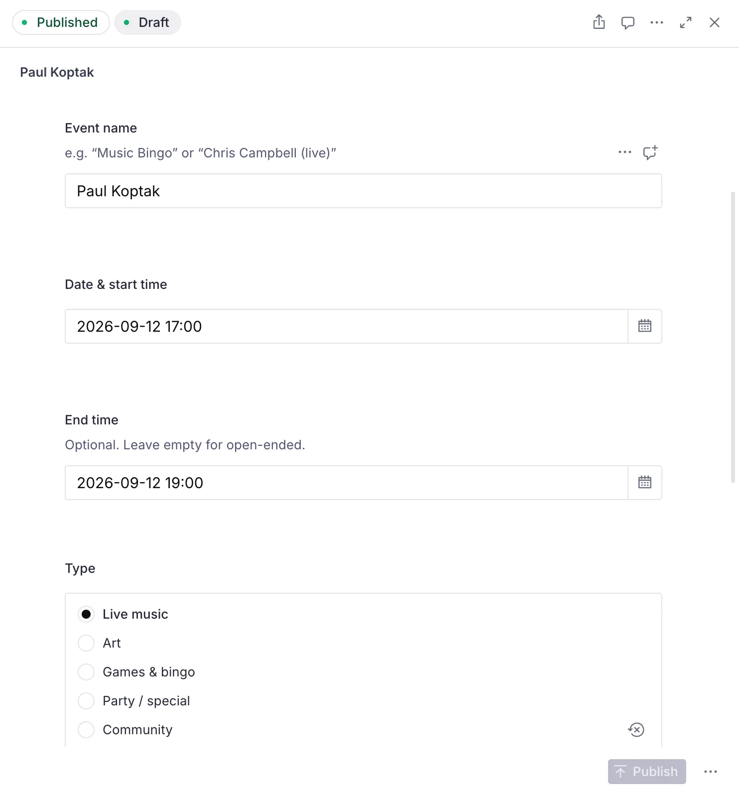

Past events disappear from the site on their own, so there's nothing to clean
up at the end of the month.

> **Tip:** The date box wants `2026-09-29 18:30` — year, month, day, then the
> time on a 24-hour clock. Or click the little calendar icon beside it and pick
> from a calendar instead.

### Weekly events

Things that happen every week — Thursday bluegrass — live under **Structure →
Weekly Events**. They show on the site as "Every Thursday" and only need
touching when the regular lineup changes. Untick **Currently running** to hide
one without deleting it.

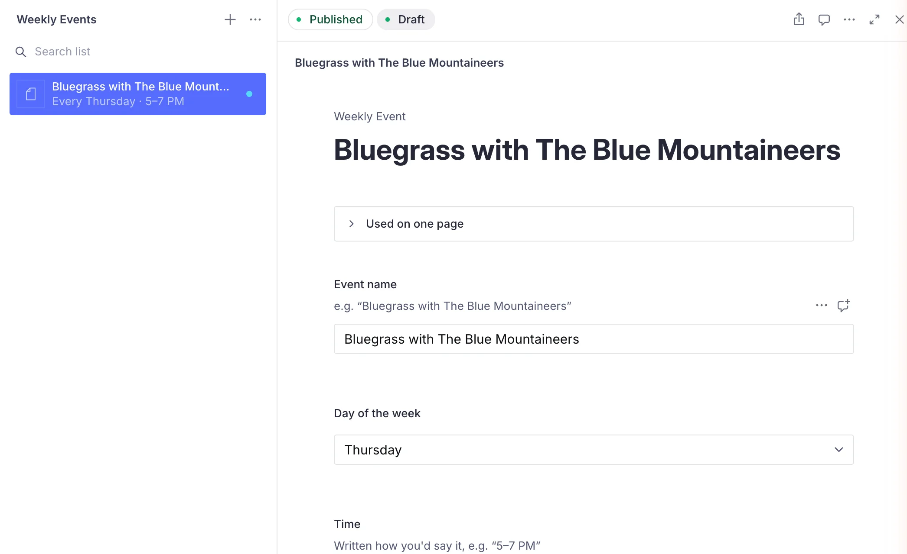

## The announcement banner

The colored strip across the very top of the site. Good for "closed today",
"anniversary party Friday", "new flyer is up".

1. Open **Site Settings** — it's what the editor opens on — and click the
   **Name & Contact** tab.
2. Scroll to **Announcement banner**, near the bottom, and type the message.
   Publish.
3. **Clear it when the news is over.** Delete the text and publish again. A
   stale banner is worse than no banner.

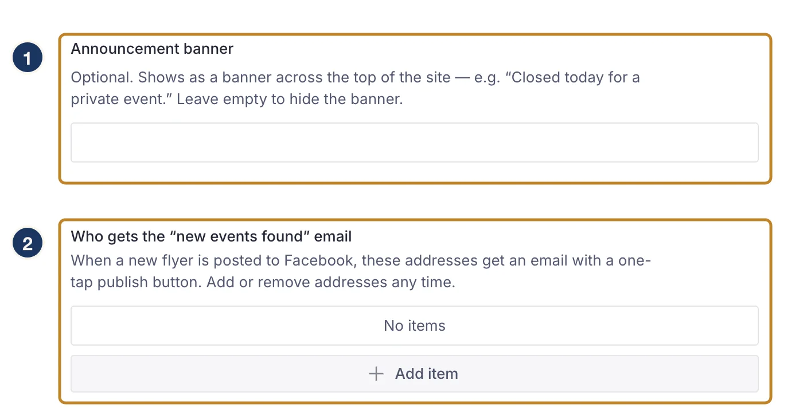

The field right below it, **Who gets the "new events found" email**, is the
list of addresses the robot writes to. Click **Add item** to add one.

## Hours, phone, and links

All of these live under **Site Settings**.

**The Hours tab** has one row per day. Click a day to change it.

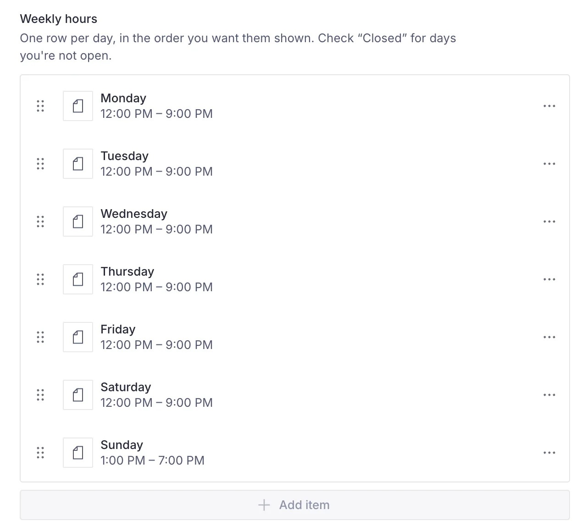

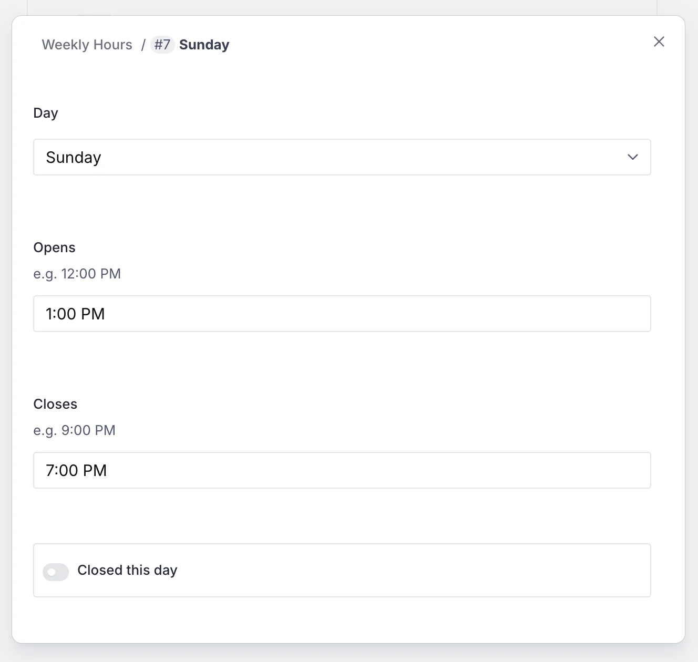

**The Name & Contact tab** has the phone number, the email address, and the
Untappd, Instagram, and Facebook links.

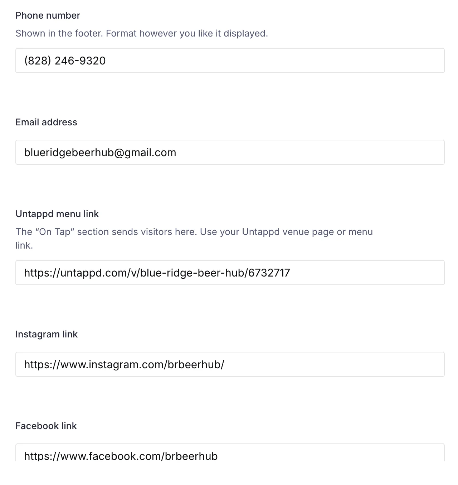

The other tabs — Top of Page, On Tap, About, What We Offer, Photos, Footer —
hold the writing for each section of the site: the tap count, the intro
paragraphs, the offer cards, the trust badges. Everything there can also be
changed by clicking it on the page.

## Photos

**Structure → Gallery Photos.** Each photo is one entry in the list. The
gallery section only appears on the site once at least one photo exists.

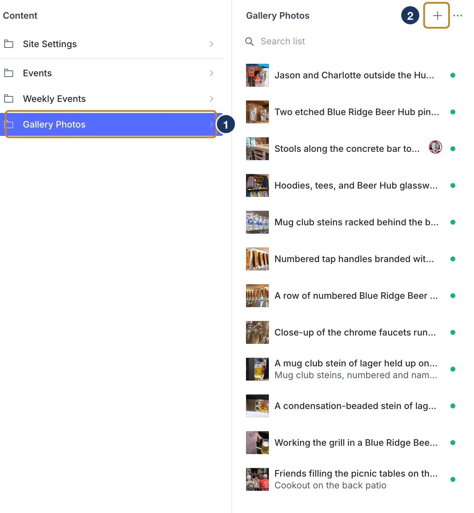

To add a photo:

1. Click **+**, then drop a picture onto the **Photo** box, or click the box
   to choose a file.
2. Write one line in **Describe this photo**. It's read aloud to blind
   visitors and shown to search engines, so say what's in the picture.
3. **Position** sets the order — lower numbers first. Leave gaps (10, 20,
   30) so it's easy to slot one in later.
4. Publish.

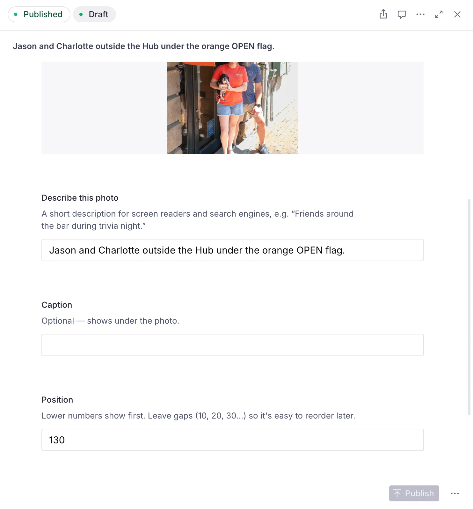

To remove a photo, open it, click the three dots next to Publish, and choose
**Delete**.

## When something looks wrong

**My change isn't showing on the site.** Did you press Publish? A yellow Draft
label at the top of the form means it's still a draft. If you did publish, give
it two minutes, then reload the page while holding <kbd>Shift</kbd>.

**I made a mess and want the old words back.** If you haven't published yet:
three dots → **Discard changes**. If you have, don't worry — every published
version is kept. Tell Skylar which page and roughly when, and it can be put
back.

**The site looks blank or out of date.** The site keeps an emergency copy of
everything baked in. If the editor is ever unreachable it quietly shows that
instead, so the page never goes blank, and it catches up on its own once
things are back.

**I can't sign in.** Use the Google account that got the invitation. To add
another person, ask Skylar.

**The "open now" label is wrong.** Check the Hours tab. Times need to look
like `12:00 PM`.

**Still stuck?** Send Skylar a screenshot of what you're seeing. A phone
photo of the screen works fine too.
